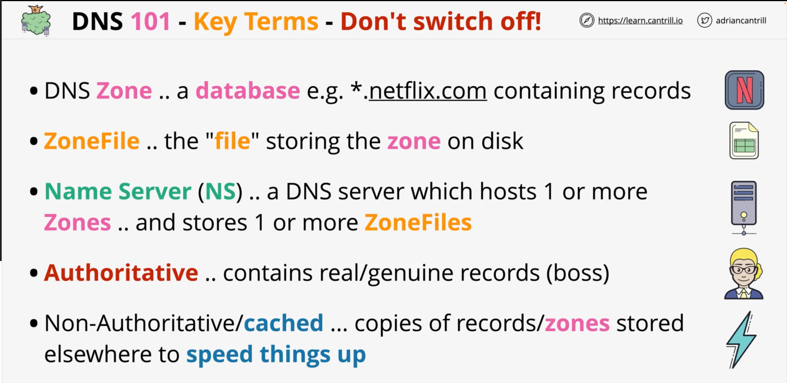

* Root zone knows which name servers the .com zone is on
* The .com zone knows which NameServers (e.g.) Netflix.com is on
* Netflix.com contains records for the Netflix.com domain and can answer queries about this

* A DNS helps locate and get a query response from the authoritative zone hosting the DNS record you need
  * If you need Netflix, the DNS zone will search for this

* Root zone doesn't have info needed, but can find Authoritative NS for .com
* .com zonefile does know the name servers that are authoritative for Netflix.com
* But, it's not a CName record but an IP

### Registering a Domain

* Registrar lets you purchase domain (R53 or Hover)
  * Pay for cats.com
* DNS Hosting Provider lets you host a DNS zone (R53 or Hover) on Name Servers
  * A DNS Zone for cat.com is ready to go
* TLD Registry registers a domain, supplying the Name Server information
  * It adds cats.com NS to the .com TLD zone (Top Level Domain)