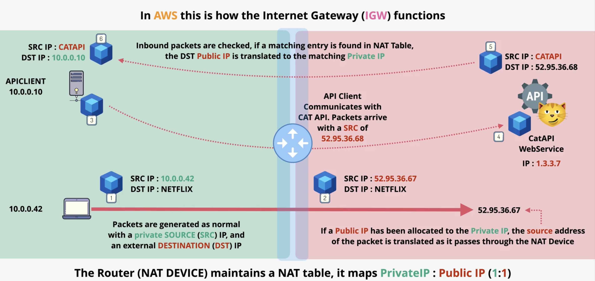
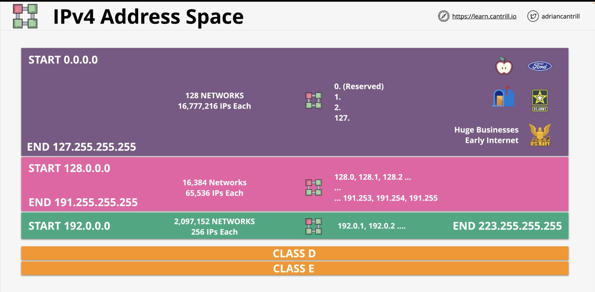

### Static Network Address Translation

* Device A (private IP) communicates with Device B (Netflix)
  * Device A will be allocated a **public IP** in order to pass through public internet
  * The source API (beginning) translates pvt IP to pub IP to send package to dest IP
  * The dest IP will then respond by sending a package to the pub IP 
  * The NAT Device (midway point) understands the pub IP source is from a pvt IP

### Dynamic NAT

* Multiple devices can have the same pub IP allocation as long as no overlap

### IPv4 Address Space

