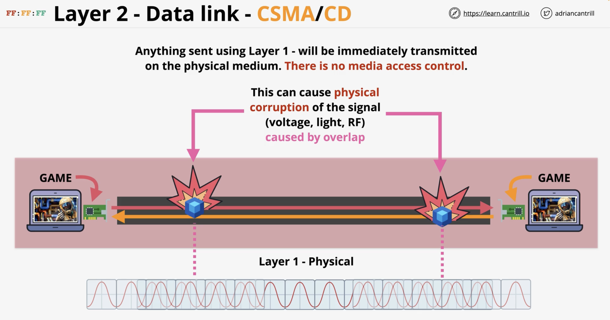

### Layer 1: Physical
* Responsible for physical transmission of data over a communication channel (wire, cable, wireless signal)

* By using a shared physical medium like Copper (electrical), Fibre (light) or WiFi (RF) they can understand binaries shared via the medium

### Layer 1: Physical - Hub

* No device addressing exists, so all devices receieve the **same** data
  * What's received one port, will be transmitted onto **every port**
  * Multiple devices transmitting at once will cause a **collision** 
  * There is *no media access control* and **no collision detection** 

### Layer 2: Data link
* Frames: Format for sending information over a layer 2 network
* Layer 2 (or ethernet frame) uses layer 1
* Layer 1 sends **frames** (raw data) onto the shared physical medium
  * Frames are simply sent onto the physical medium and received by other devices

#### MAC HEADER
* Preamble: Allow devices to know its the start of the frame
* Destination + Source MAC Address: destination and source of the frame (source allows device to receieve replies)
* Ethertype (ET): Allows specifying which layer 3 protocol is putting its data inside a frame (used for IPs etc)
  * NOTE: Layer 3 uses layer 2 frames for device-to-device communication on a local network
  * It's important to understand which layer 3 protocol was used to put data into the frame (e.g. IP)

#### PAYLOAD
* Data the frame carries from source to destination, generally provided by **layer 3** and **ET** determines which L3 protocol is used
* FCS: Allows checking for any corruption in communication

1. Layer 2 frames are generated by layer 2 **source side**
2. Raw data is transmitted onto a physical medium via Layer 1
3. Taken off the physical medium by layer 2 **destination side**
4. Passed to layer 2 which interprets the frame and then sends over to layer 3 (which interprets the data)

### Layer 2: Data link pt. 2

#### Carrier Sense Multiple Access / Collission Detection (CSMA/CD) in Layer 2

* F1 is the created frame intended for other game
* F2 is the returning data
  * F2 goes through Layer 1 for transmission (via physical medium) as *raw data*
* Layer 2 can see that it's the intended destination for it and sends the data back to the game

* Encapsulation: Process of taking data (the frame / payload), and wrapping it in something else throughout the layers
  * Before the game (see below) is given back its intended data it is **de-encapsulated** and the payload (info within the frame) is extracted from the frame
  * At every stage of the process (networking layer, transport layer) the data is encapsulated

* NOTE: Even though each layer uses the layer below it, it is always abstracted
* Web browsers function at layer 7, you dont worry about **how** this communication happens

### Layer 2: Using a Switch

* HUBS are layer 1 devices and can't understand frames
  * They are single collision domains, which **impact all devices** 
* Switches can maintain a MAC address table
  * This allows Switches to distinguish between each device 
* Switches interpret the frames and make decisions based on the **source** and **destination** of the frame

* Layer 2 allows for device-to-device communication through identifying devices via MAC addresses
* Collision detection
* Unicast communication (1:1)
* Broadcast 1:ALL
* Has Switches (HUBS with superpowers)