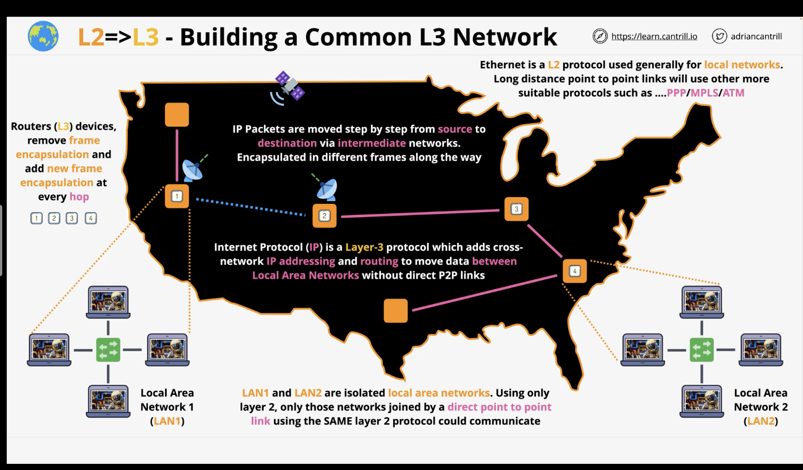
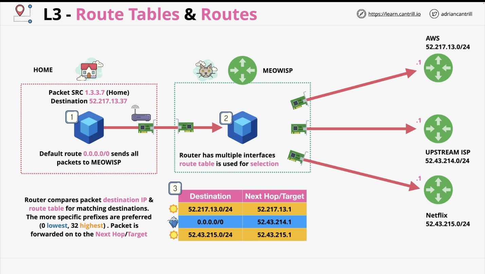
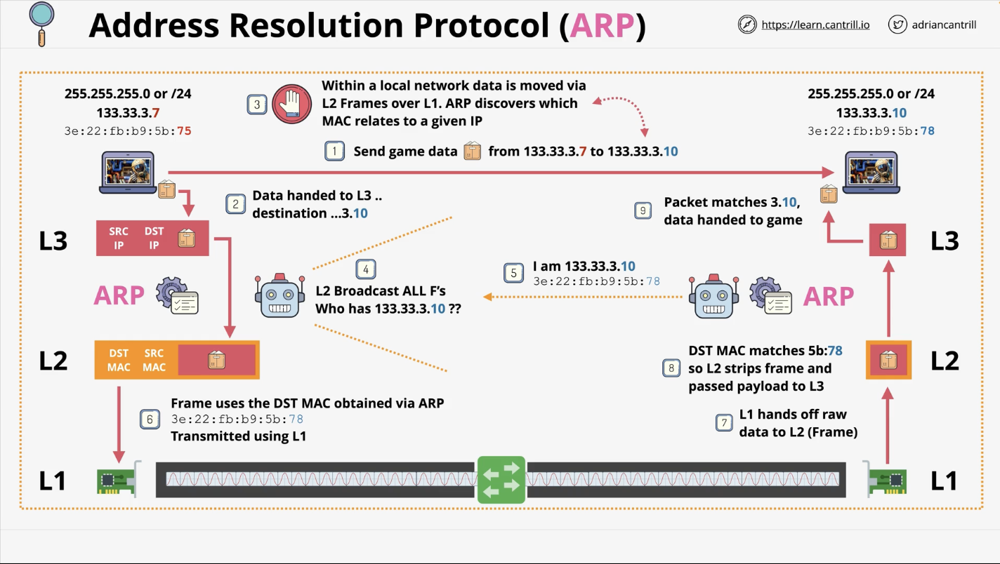
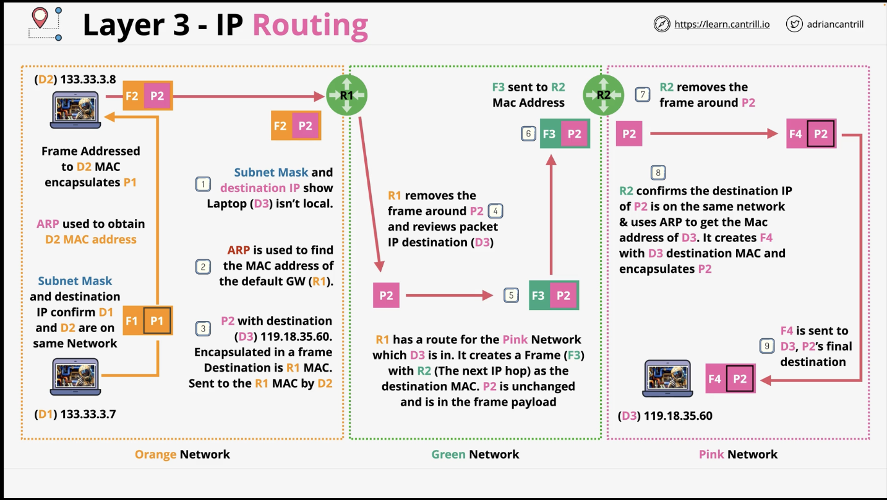

### Layer 3 - Network

* P2P Connections refer to connections made between two devices / nodes.
* Isolated networks (LANS) can be joined via P2P on layer 2
* IPs (layer 3 feature) allow for cross-networking between isolated networks

Layer 3 contains...
* V4
  * Contains protocol (ICMP, TCP, UDP etc.)
  * Contains a source and destination IP address

### Layer 3 - RT and Routes

* Packets are sent over to their dest. via routes
* Routes compare the destination IP of the packet and match it to what's found on the RT.
* It then forwards the packet to the next hop/target etc.

#### ARP
* ARP is a process running between layer 2 and layer 3
* Sending data from IP 1 --> IP 2 requires generating packet for transmission 
  * This requires the MAC address
* The ARP is used to identify the MAC address to send the packet over
* Layer 3 can now use this information to create a frame and send the packet over (Layer 2 --> Layer 1)

1. D1 sends data to D3
2. Subnet Mask identifies D1 and D3 are in separate networks
3. Packet (P1) within D1 is wrapped in a frame (F1)
4. ARP is used to find the MAC address of the default gateway (R1) which allows comm. between local and external networks via the internet
5. R1 will remove the frame around P2, leaving only the packet
6. R1 holds a route in its RT for D3. It goes through the next hop to finally reach its destination

