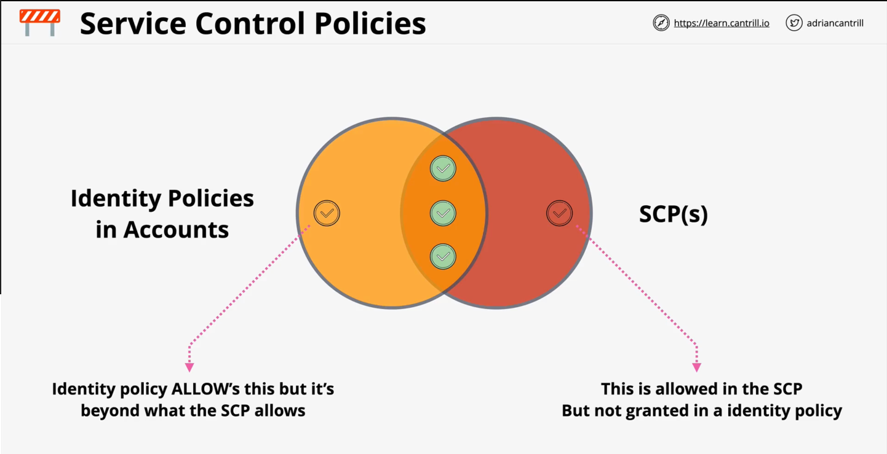

### Organisation

Management Account

* Invites other AWS Accounts into an Organisation

Organisation Root

* Container within an AWS Organisation containing AWS accounts (member / management account)
* Can create Organisational Units (OUs) to group member accounts into units

### Service Control Policies

* JSON Policy Document attached to an Organization, an OU or an individual AWS Account
  * If attached to an Organisation, it will impact **all** Accounts in the Organisation
  * If attached to an OU, it will impact **all** within the OU

* SCPs are *account permissions boundaries*
* They limit what the account (including account root user) can do
  * In that they restrict the identities (roles etc.) within the Account
  * The Root User **ALWAYS** has permissions, just limits what accounts within the user can do (AWS Organisation)
* Can have an **ALLOW** and **DENY** list

SCP & Identity Policies in Accounts

* SCPs don't grant permissions, they simply provide a list of allowing and denying
  * If your SCP allows it, but your identity policy doesn't grant it, you don't get access
  * If your identity policy allows it, but your policy doesn't, you don't get access

