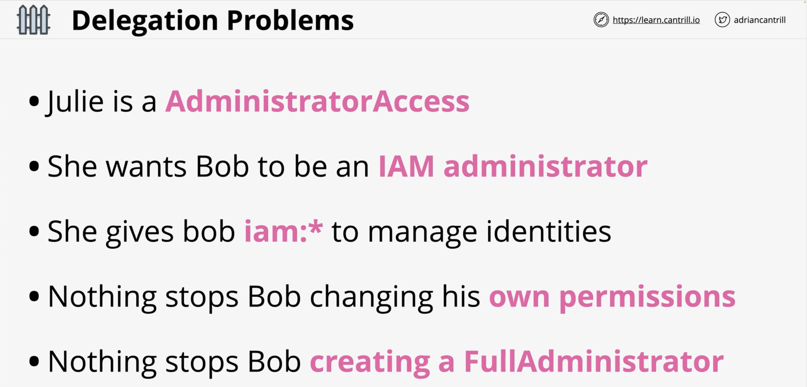
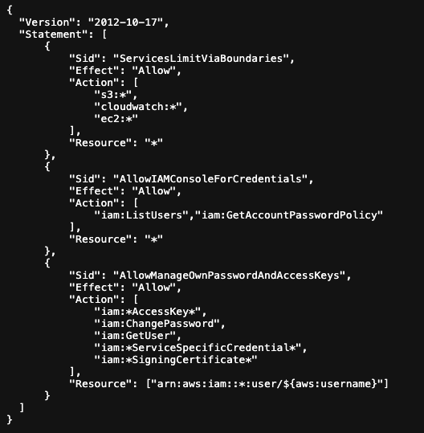
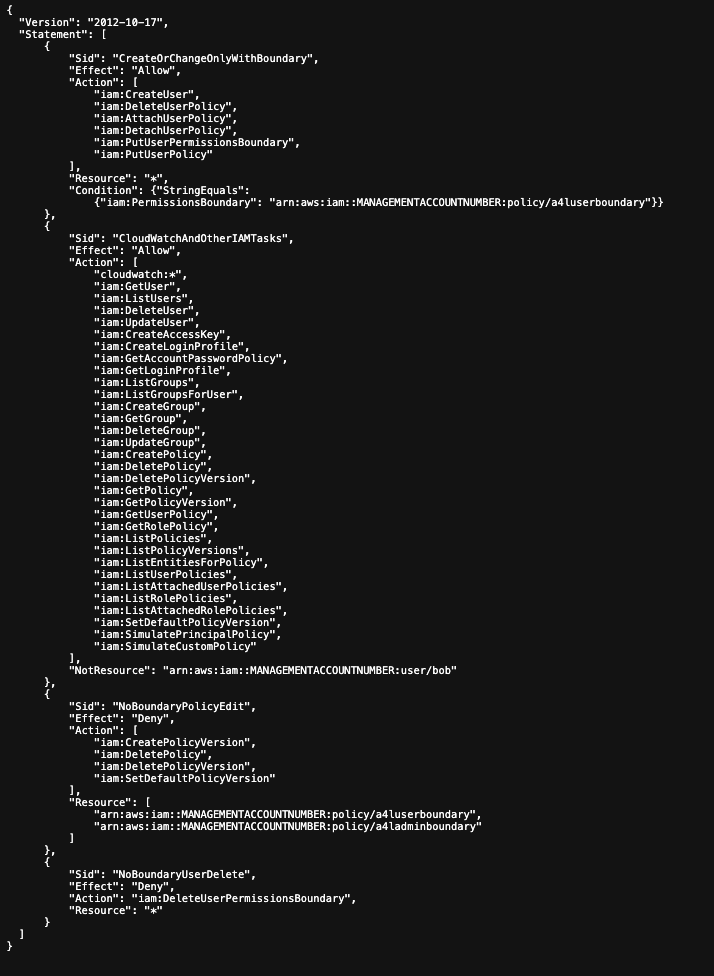
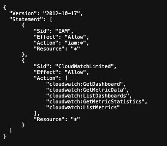

* Allow use of specified services (s3, ec2, cloudwatch)
* Allow grabbing password policies
* Allow managing password and access keys

* Perform Actions, as long as you have the a4luserboundary
* If the user is Bob, then they're unable to perform the listed actions
* Bob (or anyone) can only grant this policy to another user **if** they have the permission boundary of a4lboundary set also
* They are restricted to only the a4luser-boundary permissions 

* Bob's limited actions are provided here
* Assigning the policy permissions to Bob
* Assigning a permission boundary (second above) to Bob ensures that...
  * Even if Bob were to gain the above permissions he would be restricted due to the policies in the permissions boundary policy