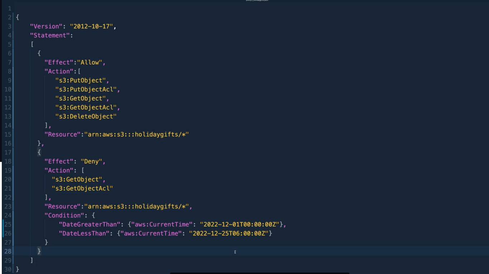
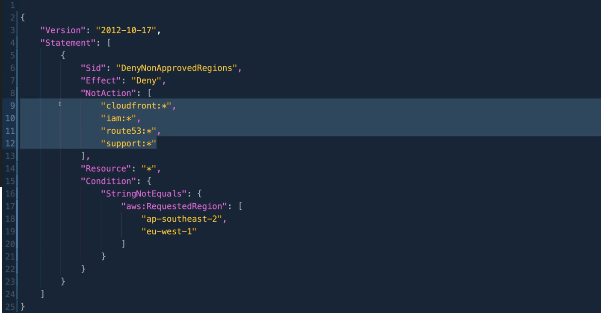
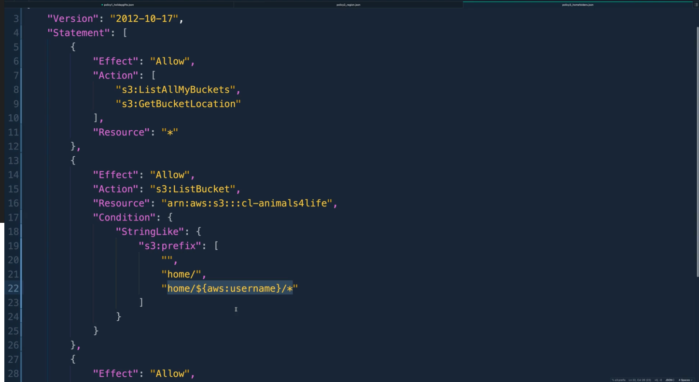

### Multi-Part Policy

* Policy applied to S3 Bucket
  * During the periods (01/12/22 and 25/12/22) the bucket is WRITE only (PUT)
  * Outside of that, it's both READ and WRITE



* Default permission in AWS is implicit DENY
* A single policy which ONLY contains a DENY will be accompanied by a set of policies with ALLOW
  * This is because AWS policy by default == DENY
* STATEMENTS with a DENY only will have no effect (as by default it's already set to DENY)

### Inverse Conditions

* Deny everything EXCEPT what's listed in the NotAction clause
* The above condition only reverts to True (Deny Everything Except) if NOT **ap-southeast-2 and eu-west-1** 
* If you're in us-east-1 you can ONLY interact with the listed resources  (cloudfront, iam, route53, support)
* If you're in ap-southeast-2 or eu-west-1 you can interact with ALL resources




```bash
{
  "Effect": "Allow",
  "Action": "s3:ListAllMyBuckets",
  "Resource": "*"
}
```
Typical policy statement
* Some S3 Actions are account-level actions, not resource-specific. They don't target specific resources (particular bucket)
  * They apply to **ALL** resources within that account 
* This policy would be attached to an IAM entity, rather than an AWS resource 

For a singular policy (s3:ListBucket) then you have other parameters...
* If you have the assigned policy and it's within the specified prefix (home/, home${aws:username}/*), you can list the bucket



* Allow any S3 actions in your home folder or inside your particular folder.

```bash
{
  "Effect": "Allow",
  "Action": "s3:*",
  "Resource": [
    "arn:aws:s3:::example-bucket/home/{$aws:username}",
    "arn:aws:s3:::example-bucket/home/{$aws:username}/*"
  ]
}
```