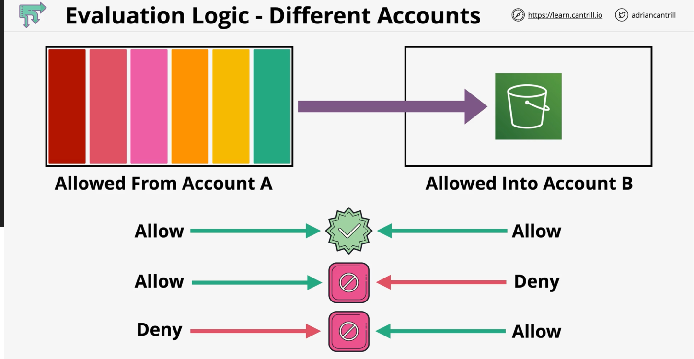
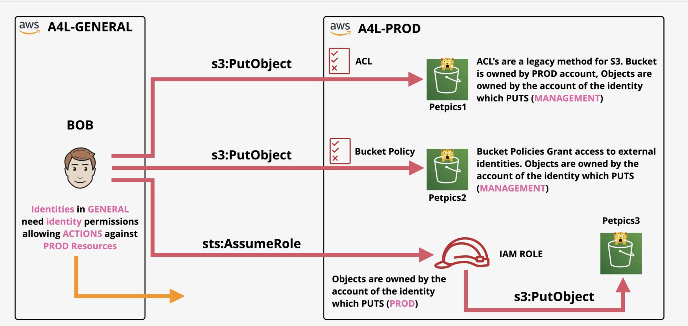

### Identity Policies

* Directly attached to IAM entities (users, groups, roles etc.)
* They grant long term permissions to an IAM entity
* IAM Users can have identity policies directly attached, this defines their permissions


### Session Policies
* Temporary policies attached to a user or role (not group) for a particular task
* Session policies are not directly applicable unless the user is assuming a role or accessing AWS as a federated user through a session.
* IAM Roles have their own defined permissions, they can simply be furthered (to make more restrictions etc) through an attached policy


### Cross/Multi-Account Access

* Evaluating Permissions: Account A (containing identity policies) and Account B has the resource-based policies. 
  * For an **identity** to access a resource in Account B, there needs to be mutual **Allows**




EXAMPLE:

General Account - Production Account
ACLs

* Production Account had created S3 buckets
* General Account had no permissions to access (implicit deny on Production side)
* Legacy Canonical ID of the General Account was copied onto the ACL of the S3 bucket so it could get access too
* To work ACLs, you need to know the canonical ID of any accounts you want to grant access
  * Any objects uploaded are *owned* by that external account you added


Bucket Policies 
S3: PUT OBJECT

Allow the following actions on the bucket, as well as all contents within the bucket

```bash
{
  "Version": "2012-10-17",
  "Statement": [
    {
      "Effect": "Allow",
      "Principal": {
        "AWS": "arn:aws:iam::[ACCOUNT_ID]:user/iamadmin"
      },
      "Action": [
        "s3:GetObject",
        "s3:PutObject",
        "s3:PutObjectAcl",
        "s3:ListBucket"
      ],
      "Resource": [
        "arn:aws:s3:::bucketname/*",
        "arn:aws:s3:::bucketname"
      ]
    }
  ]
```

sts:AssumeRole
* Creating a Role within the Production AWS Account...
  * Makes any uploads into an S3 from that role owned by the PROD account...
* Rather than using a Cross-Account access method...
* Or using ACLs or bucket policies... (results in objects being owned by the uploader)
  * Creating a role in AWS account
    * Grant other identities access to that ROLE
    * Anything that is created is also OWNED by the AWS account, making things cleaner

