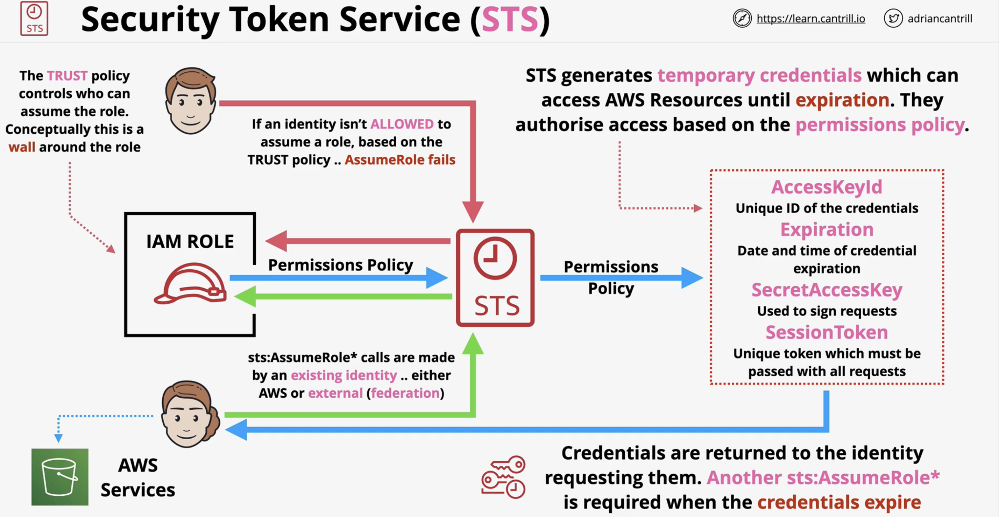

### Resource Access Manager

* Share AWS resources between AWS accounts
* Shared with Principals (Accounts, OU's and Organisations)

* Within RAM, there is a concept of an **owner account**
  * Account that owns the object that is being shared
  * Create a resource share, and you share that with others
* Owner retains **full ownership** of that resource
* When sharing resource, you always **share** with a principal in mind 

### Availability Zone (AZ IDs)
* Inconsistent AZ names can occur
* USE1(matching the region) - AZ1 (AZ number)
  * These are consistent across accounts.

* The ability to provision services, and read network objects doesn't change ownership of the resources
* Each account is an owner of what it has created
* Participants can 
  * View subnets 
  * Reference them in SGs 
  * Provision resources into them... 
  * But cannot see / modify what they didn't create

