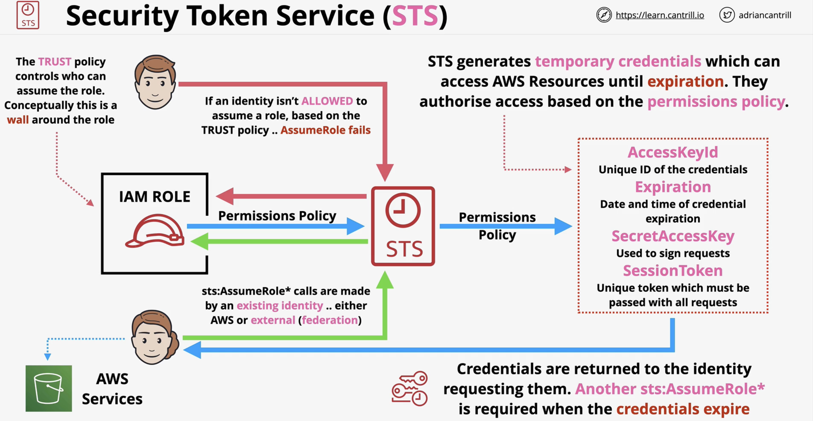
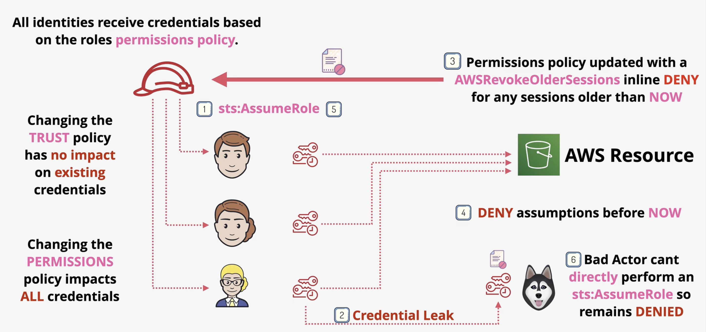

### Security Token Service

* Generates temporary credentials (sts:AssumeRole*)
* STS' can expire
* Requested by an Identity (AWS via IAM Role or an External via Google login, FB etc)

STS uses **permissions policy** to generate temporary credentials
  * Permissions Policies are generated in JSON format

### Revoking Temporary Credentials

1. Users assume temporary Role
2. Credential leak: Bad Actor has credentials for Role
3. Create a permission policy which revokes older sessions of the Role, only Users with updated roles can use
4. Bad Actor has credentials, but not part of trust policy, so can't **update** the date
   1. Bad Actor has access to everything (technically as credentials give perms)
   2. But Bad Actor can't access anything **because he can't update his credentials** which rejects AWS pros & services
5. CANNOT MANUALLY INVALIDATE TEMP CREDENTIALS
6. YOU CAN ADD ADDITIONAL POLICIES TO AVOID CREDENTIAL LEAKS (denying everyone access before a certain date & time)

1. Actor manages to hack into EC2, this grants them access to the Role which has Admin Access (via EC2)
2. Adding a Revoke Session to the role attached to the EC2 means only new identities (including EC2s) have permissions
3. EC2 no longer has access (it was made prior to the Revoke Session update)
   